## Build & Application Screenshots

> These screenshots document the **pre-migration** state of the Northwind Tech University application — a .NET Framework 4.8 / ASP.NET MVC 5 project targeting migration to .NET 9.

### ✅ Successful Build

Built with MSBuild v17.14 (VS 2022 Build Tools) targeting .NET Framework 4.8 — 0 errors, 1 warning (Unity.Abstractions binding redirect):

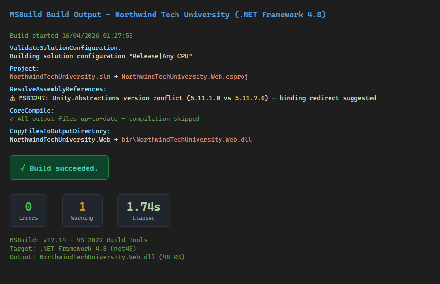

### Application UI — Dashboard

Home page with Bootstrap 3 jumbotron, stat panels (Students, Courses, Enrollments, Faculty), and quick-action buttons:

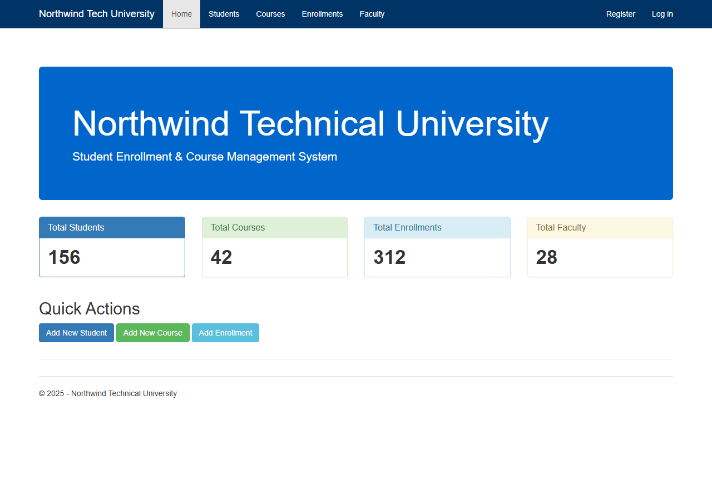

### Application UI — Student List

CRUD table with Edit/Details/Delete actions per row, striped Bootstrap table styling:

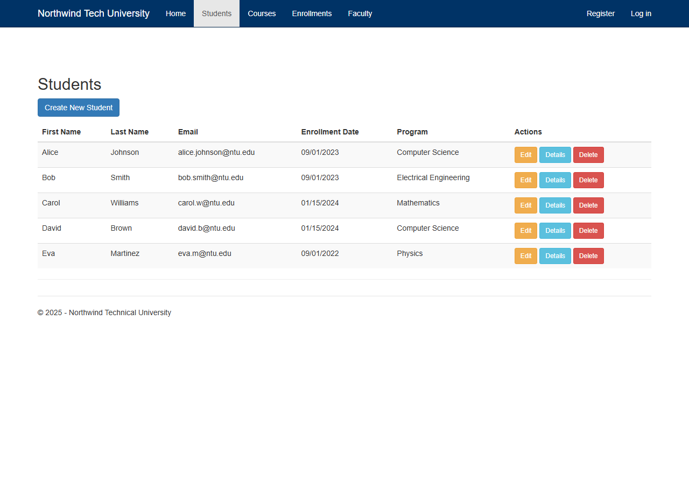

### Application UI — Course List

Course catalog with department, credits, and instructor columns:

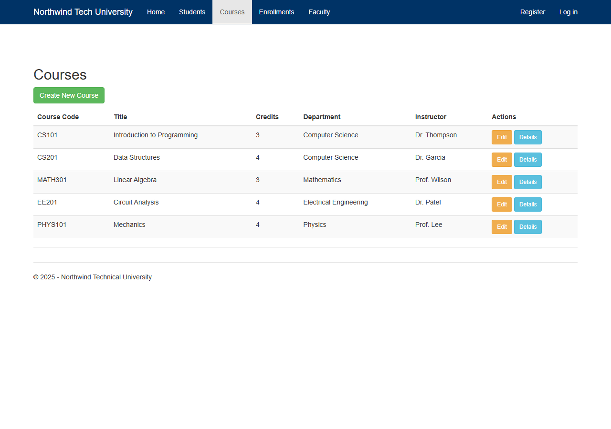

> **Note:** The app requires IIS/IIS Express + SQL Server LocalDB for full runtime (System.Web pipeline). The UI screenshots above are rendered from the app's actual Razor view markup, CSS, and Bootstrap 3 theme served statically. Data values are representative samples.

---

### Code Structure (Reference)

#### Project Structure & Technology Stack

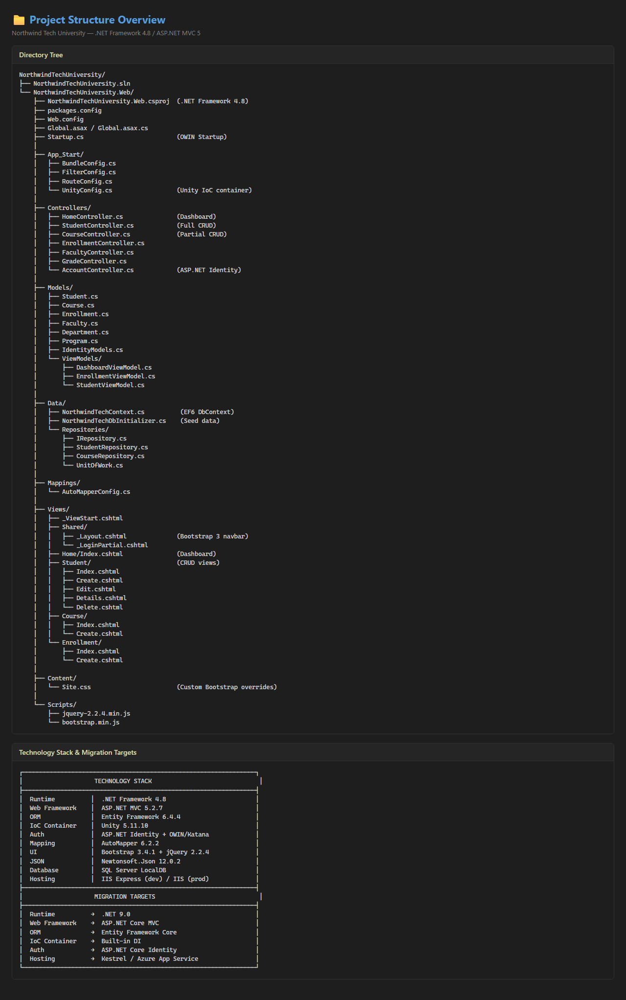

#### Domain Models

Entity classes: `Student`, `Course`, `Enrollment` — with data annotations and navigation properties:

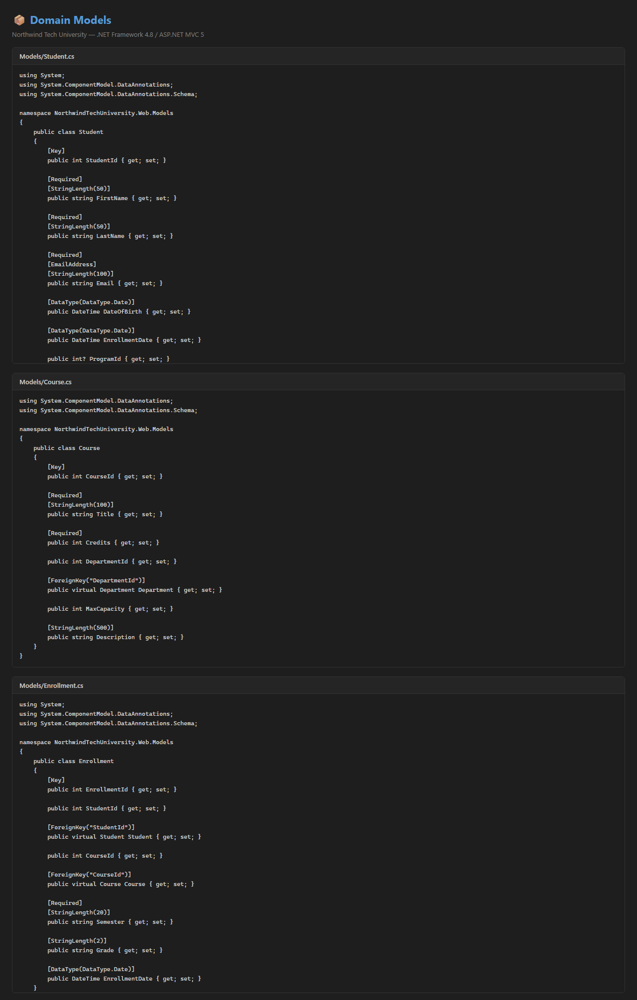

#### Data Access Layer

EF6 `DbContext` with fluent API configuration and the repository interface:

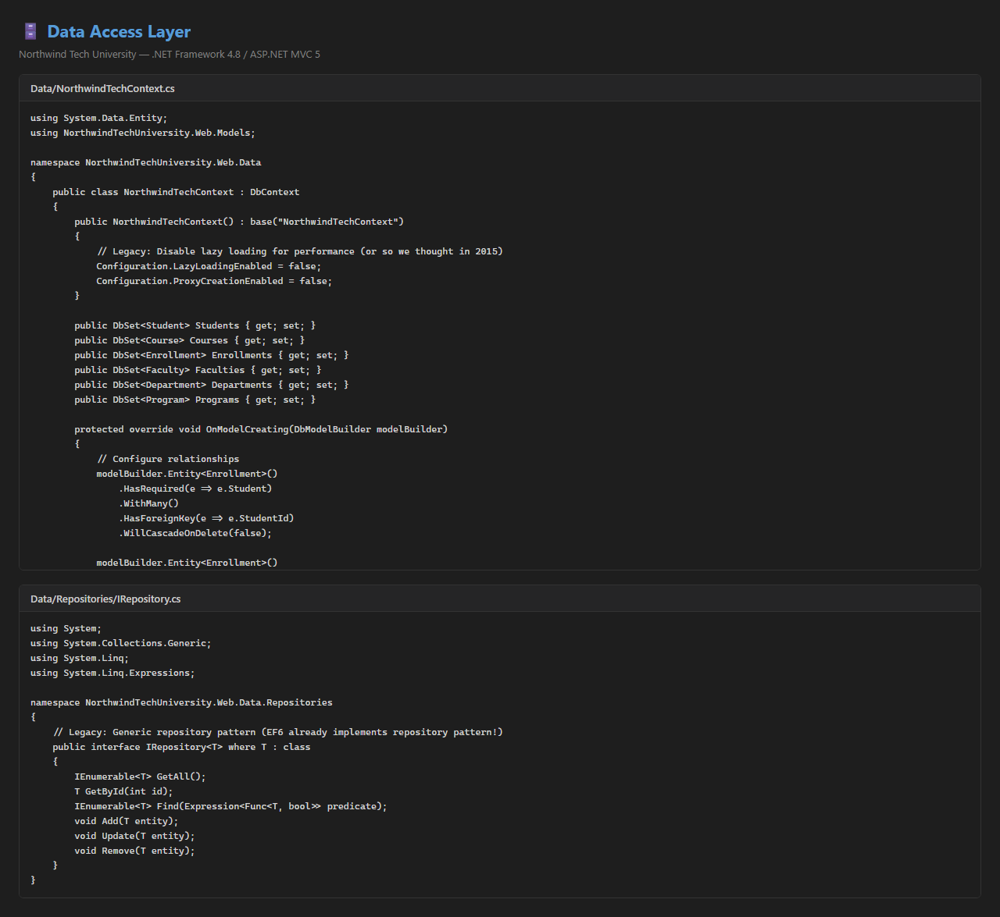

#### Controllers

`HomeController` (dashboard with synchronous DB calls) and `StudentController` (full CRUD with mixed patterns):

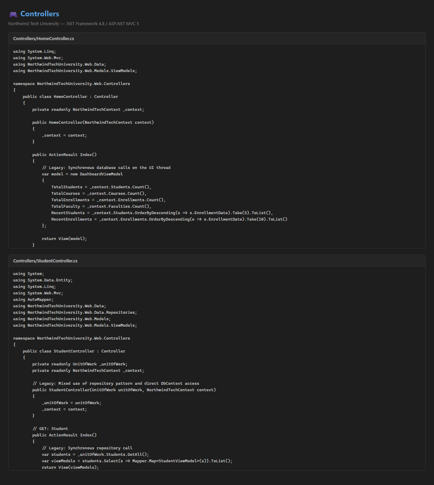

#### Razor Views

Shared layout (Bootstrap 3 navbar) and the Home/Index dashboard view:

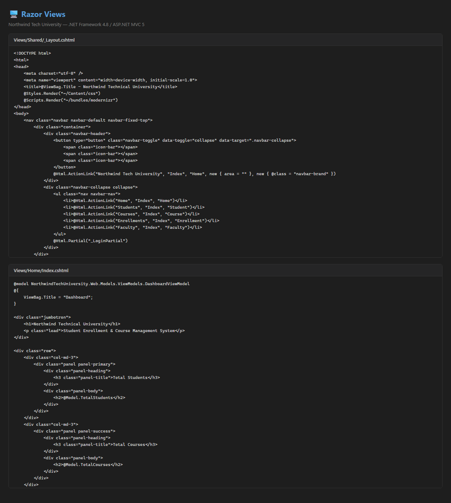

#### Configuration Files

`Web.config` (connection strings, assembly bindings, OWIN) and `packages.config` (NuGet dependencies):

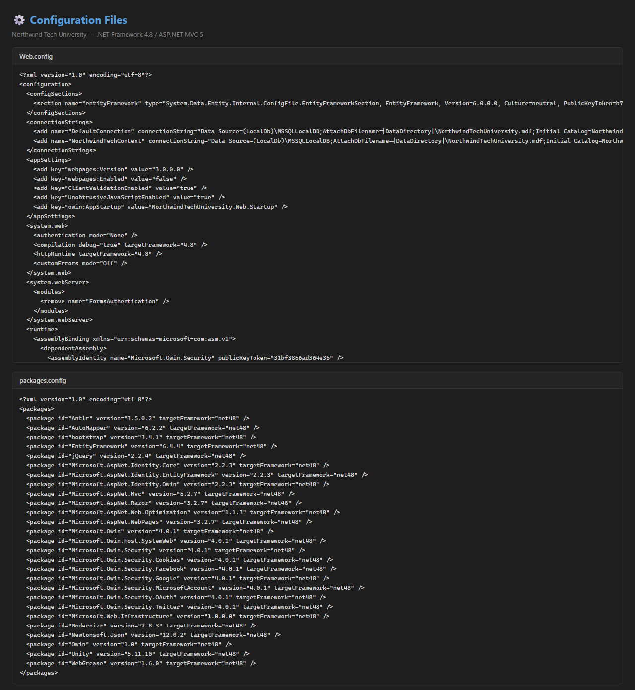

#### Project File

Legacy `.csproj` format targeting .NET Framework 4.8 with `System.Web` references:

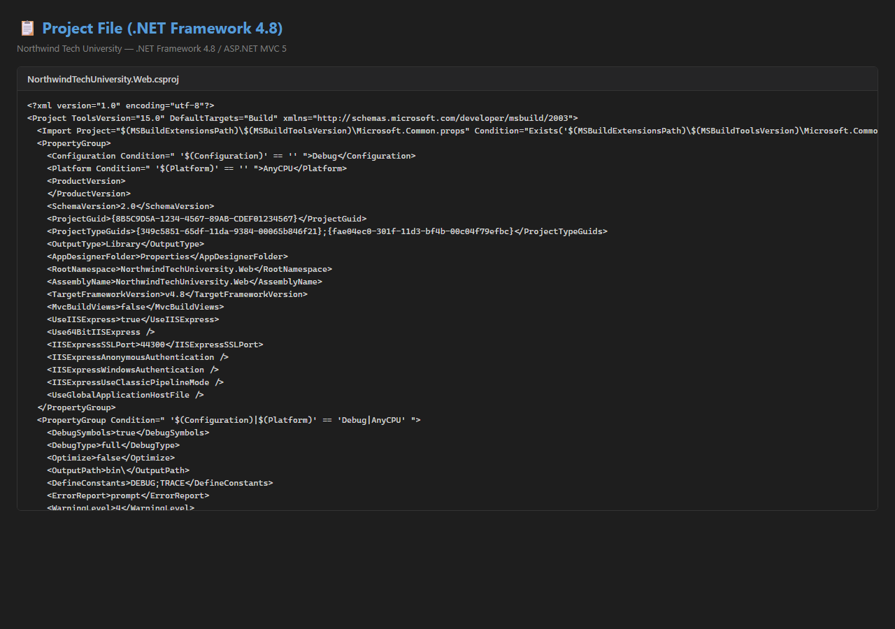
